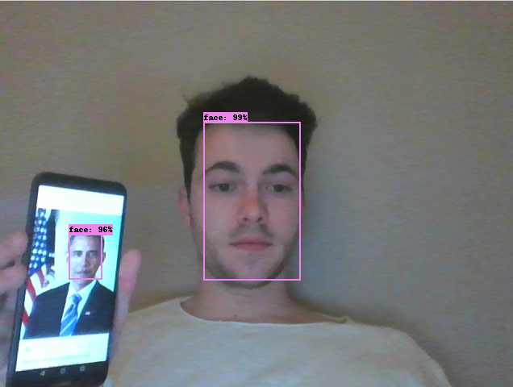
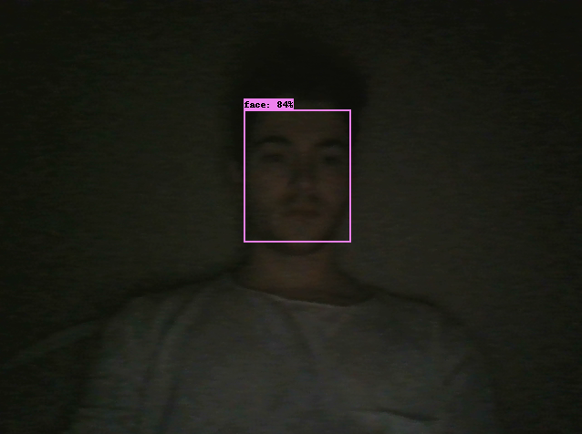

# Tensorflow face detection

Tensorflow face detection implementation based on Mobilenet SSD V2, trained on Wider face dataset using Tensorflow object detection API.


## Dependencies

* Tensorflow >= 1.12
* OpenCv
* imutils

```
pip install -r requirements.txt
```

## Usage
```
python face_detection_webcam.py
```

## Docker


```
docker build -t face_detection .
```

Run the project with pre-trained model :

```
bash runDetection.sh
```

## Result 
Achieves 19 FPS with a 640x480 resolution on Intel Core i7-7600U CPU 2.80GHz × 4 U. 

<p float="left">
   
  
</p>


## Train Model

If you want to train your own model, i advise you to follow the tutorial about tensorflow object detection api, you'll just need to download an annotated dataset. 

## Reference
* <a href = "https://tensorflow-object-detection-api-tutorial.readthedocs.io/en/latest/"> Tensorflow object detection API</a>

* <a href = "http://mmlab.ie.cuhk.edu.hk/projects/WIDERFace/">WIDERFace dataset</a>
